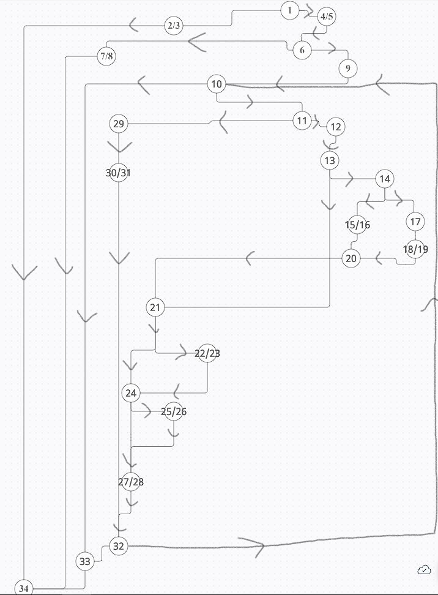

# SI_2022_lab2_202009

Иван Павловски 202009

2. 
    

3. 
    Цикломатската комплексност е 8.
    Според бројот на региони.
4. Every statement  
    За да ја исполнам every statement методата ми требаа 4 тест случаи  
    List-size <= 0 - ќе ја фрли првата грешка  
    List-size = 3 - ќе ја фрли втората грешка    
    List = { 0 # 0 0 0 # 0 # #} - ќе ги исполни скоро сите линии освен линиите 8/9 и 15/16  
    List = { # 0 # # # # # # # } - ќе успее да ги исполни линиите 15/16 и со тоа ќе се исполнат сите линии.  
5. Every branch
    List-size <= 0  
    List-size = 3  
    List = { 0 # 0 0 0 # 0 # # }  
    List = { # 0 # # # # # # # }  
    Со истите тест случаи ќе добијам и every branch coverage
6. За unit тестовите ги искористив овие тест случаи од 4. и 5.  
    
